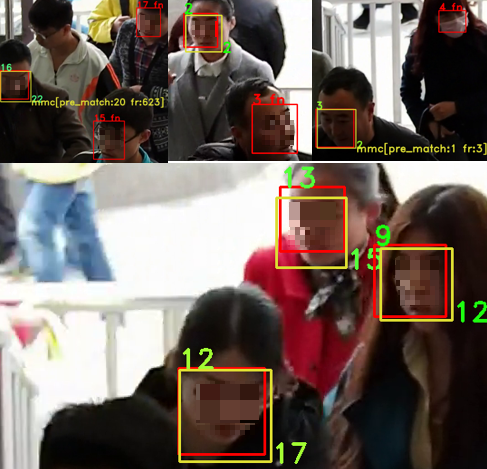
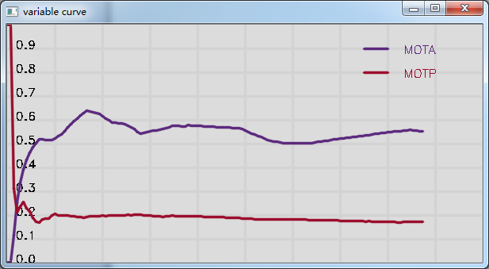

# CLEAR-MOT

## Evaluating Multiple Object Tracking Performance.
- Implementation of The CLEAR-MOT metric.
- This metric is described in the paper [1].

## Demo

- Video face detection and tracking [red: ground-truth]

- MOT accuracy curve

## References

[1] Keni Bernardin and Rainer Stiefelhagen. "Evaluating multiple
objec tracking performance the CLEAR MOT metrics" J.Image Video
Process. 2008, Article 1 (January 2008), 10 pages. DOI=10.1155/2008/246309
http://dx.doi.org/10.1155/2008/246309

